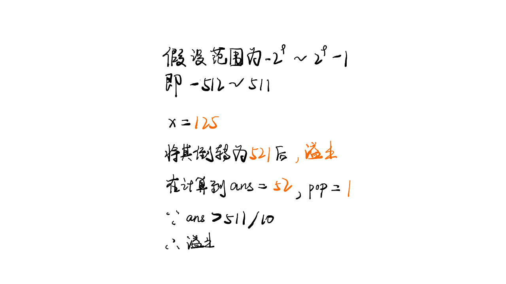
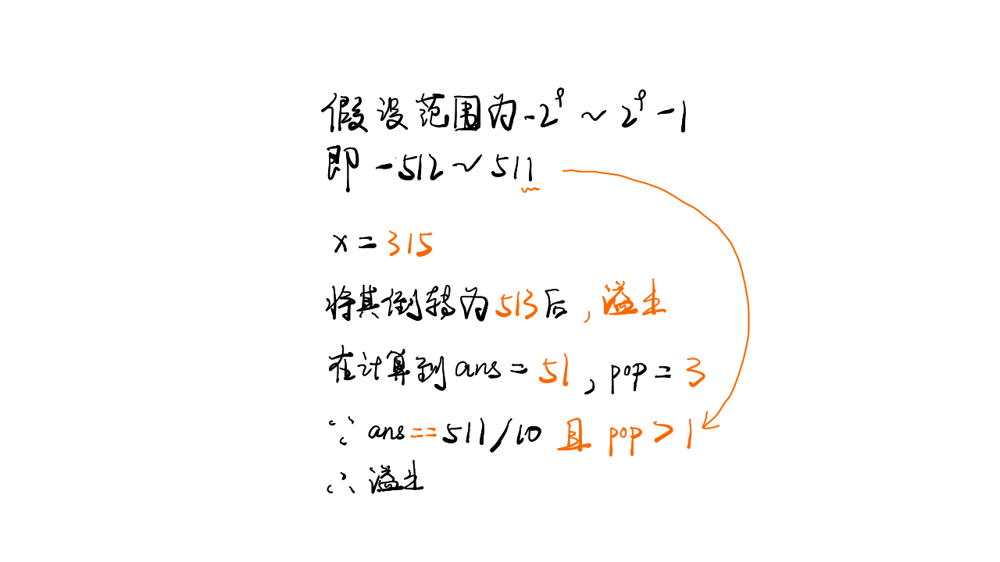

# [Leetcode007.整数反转](<https://leetcode-cn.com/problems/reverse-integer/>)

- 方法分析

  这道题目介绍两种解法：

  - 整数溢出判断条件已知，利用溢出条件判断是否溢出

    若不需要考虑整数溢出则只需要不断将整数$x$的最低位$popNum$取出然计算$result=result \times 10 + popNum$即可。

    数学上判断整数是否溢出的方法为：

    - 如果$result > \frac{INT\_MAX}{10}​$，则一定会溢出
    - 如果$result == \frac{INT\_MAX}{10} \&\& popNum > 7$或者$result == \frac{INT\_MAX}{10} \&\& popNum <-8$，整数也会溢出

    整数反转和溢出判断的图示如下所示：

    
    

  - 整数溢出判断条件未知，直接和最大值进行比较

    这种情况下不需要利用数学的溢出判断条件，直接将结果和最大数进行对比。

    首先将输入整数$x$和反转的结果$result$强转型为$long \space long$类型，防止溢出。对$x$取绝对值，分别判断$x>0$和$x<0$时，$result$和最大整数的大小即可判断反转后的数字是否溢出。

    若溢出则返回0，否则直接返回$result$的值。

    

- 复杂度分析

  - 时间复杂度

    时间复杂度为$O(logx)$。

  - 空间复杂度

    空间复杂度为$O(1)​$。
