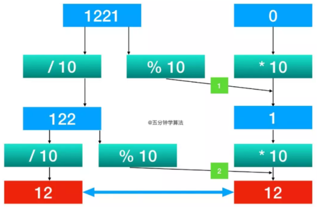

# [Leetcode009.回文数](<https://leetcode-cn.com/problems/palindrome-number/>)

- 方法分析

  回文数的判断可分为三种情况：

  - 数字位数为奇数

    数字位数为奇数时，一定会有一个中间数字，将中间数字右边的数字反转后与左边数字进行比较即可。若相等则为回文数，否则不是回文数。

  - 数字位数为偶数

    数字为偶数时，没有中间数字，需要从中间位置将数字对半分开，取右边的数字反转后与左边数字比较即可。若相等则为回文数，否则不是回文数。

  - 特殊情况

    有几种特殊数字直接可判断是否回文数，可直接返回结果。如负数和以0结尾的数字都不是回文数，0是回文数。

  回文数的判断方法有两种：

  - 将数字转化为字符串再对比前后两部分字符串是否相等
  - 直接对比前后两部分数字，若相等即为回文数**(推荐)**

  回文数的判断过程图解如下所示：

  

- 复杂度分析

  - 时间复杂度

    整个判断过程只需要一个while循环，时间复杂度为$O(logn)$。

  - 空间复杂度

    整个判断过程只需要定义少量变量，时间复杂度为$O(1)$。
