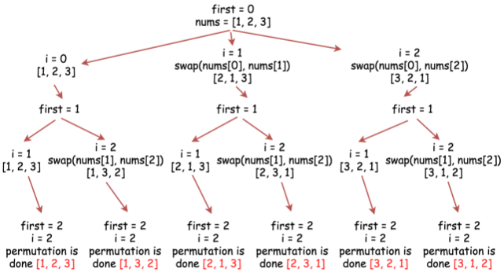

# [Leetcode046.全排列](https://leetcode-cn.com/problems/permutations/)

- 方法分析

  全排列的问题通常用回溯法解决。

  方法为定义一个索引变量`first`，不断遍历`first`到`size-1`范围内的所有整数和数组中索引`first`指向的数字进行交换，直到`first`等于数组的大小。回溯交换的示意图如下图所示。
  
  
  
- 复杂度分析

  - 时间复杂度

  - 空间复杂度

    由于要保存$n!$个数组，所以空间复杂度为$O(n!)$。
  
    
