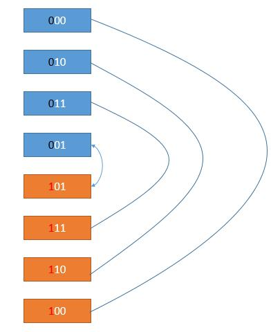

# [Leetcode89.格雷编码](https://leetcode-cn.com/problems/gray-code/)

- 方法分析

  根据格雷编码的定义可知，两个连续的二进制编码之间仅有一个bit的数值差异，而且格雷编码序列必须以0开头，总而言之，当编码的总位数为$n$时，其格雷编码的长度为$2^n$，当$n=0$时，格雷编码的长度为$2^0=1$，即当$n=0$时，格雷编码序列为[0]。**注意：**格雷编码的序列可能不唯一，如当$n=2$时，其格雷编码序列可能为00--01--11--10或者00--10--11--01，但只需要返回其中一个结果即可。

  由于当$n=2$时的格雷编码比较好计算，所以我们可以利用动态规划的思路，先解决小问题，再推广到大问题。当$n=3$时，可以在$n=2$的格雷编码序列基础上在最高位增加0或者1即可得到$n=3$时的格雷编码序列。如下图所示：

  

- 复杂度分析

  - 时间复杂度

    时间复杂度为$O(2^n)$。

  - 空间复杂度

    空间复杂度为$O(1)$。
