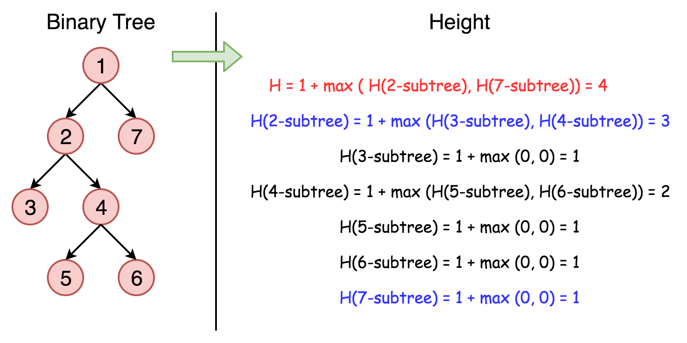

# [Leetcode104.二叉树的最大深度](<https://leetcode-cn.com/problems/maximum-depth-of-binary-tree/>)

- 方法分析

  这道题目介绍两种解法：

  - 递归法

    递归法是利用深度优先搜索(DFS)策略来搜索二叉树的每一个节点来计算二叉树的深度的，递归过程如下图所示：

    

  - 迭代法

- 复杂度分析

  - 时间复杂度

    由于每个节点都需要访问一次，所以两种方法的时间复杂度均为$O(n)$。

  - 空间复杂度

    - 递归法

      在最糟糕的情况下，树是完全不平衡的，如每个节点只剩下左子节点，递归将会被调用$n$次(树的高度)，因此保持调用栈的存储空间为$O(n)$

      在最好的情况下，树是完全平衡的，树的高度为$log(n)$，因此，此时空间复杂度为$O(log(n))$。

    - 迭代法
