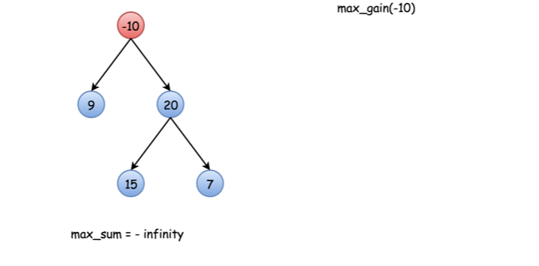
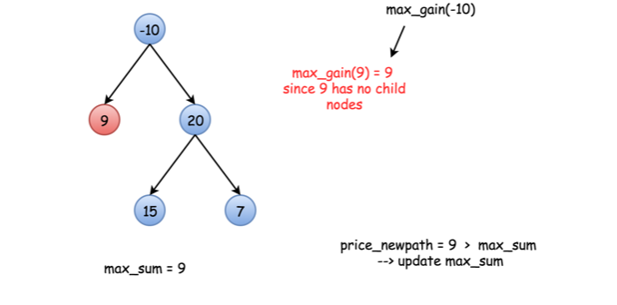
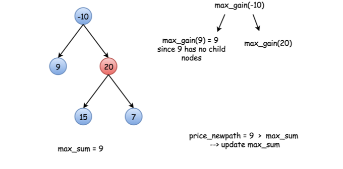
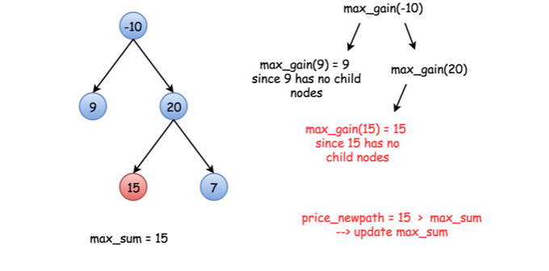
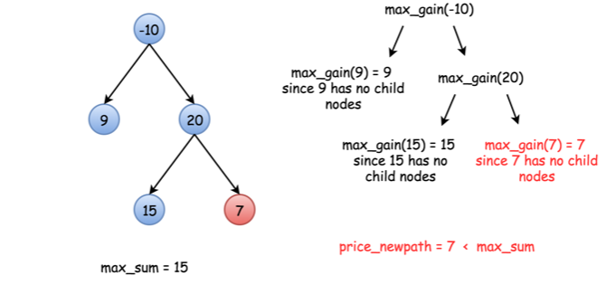
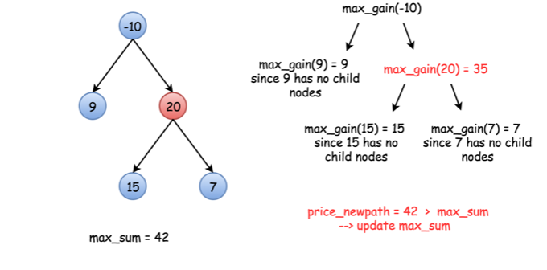
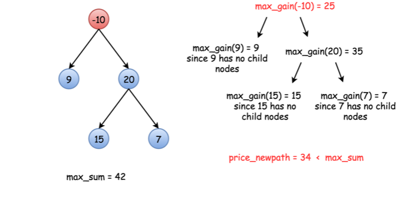

# [Leetcode124.二叉树中的最大路径和](https://leetcode-cn.com/problems/binary-tree-maximum-path-sum/)

- 方法分析

  此题可利用递归法求解。

  - 当最大路径和包含根节点时，可以递归计算子节点的路径和，然后再和根节点的值相加，即为最终的路径和。如下图所示：

    

  - 当最大路径和可以不包含根节点时，则在计算路径和时需要将当前的最大路径和与新计算的路径和进行比较，始终保存最大的路径和。如下图所示

      

    

    

    

    

    

- 复杂度分析

  - 时间复杂度

    由于整个递归过程对每个节点的访问不超过2次，所以时间复杂度为$O(n)$。

  - 空间复杂度

    由于采用的递归方法，所以需要一个大小与树的高度相等的栈内存，所以空间复杂度为$O(logn)$。
