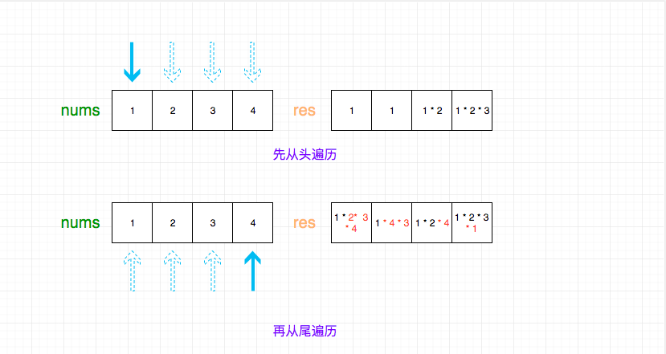

# [Leetcode238.除自身以外数组的乘积](<https://leetcode-cn.com/problems/product-of-array-except-self/>)

- 方法分析

  由于题目要求不能使用除法而且时间复杂度要为$O(n)$。所以就不能进行两层遍历，而且也不能通过计算所有元素乘积后再除以当前元素的方法。

  这道题目的解题思路是：

  - 先从左到右遍历一遍数组，并计算前$i$个元素的乘积(不包括第$i$个元素)，保存在乘积数组中
  - 再从右往左遍历一遍数组，用乘积数组乘以右边所有元素的乘积(不包括第$i$个元素)

  假设输入数组为{1, 2, 3, 4}，则整个计算过程如下图所示：

  

- 复杂度分析

  - 时间复杂度

    计算乘积的过程中需要遍历两遍数组，时间复杂度为$O(n)$。

  - 空间复杂度

    整个过程除了传入的数组$nums$外还需要定义一个数组存放计算的乘积，所以空间复杂度为$O(n)$。
